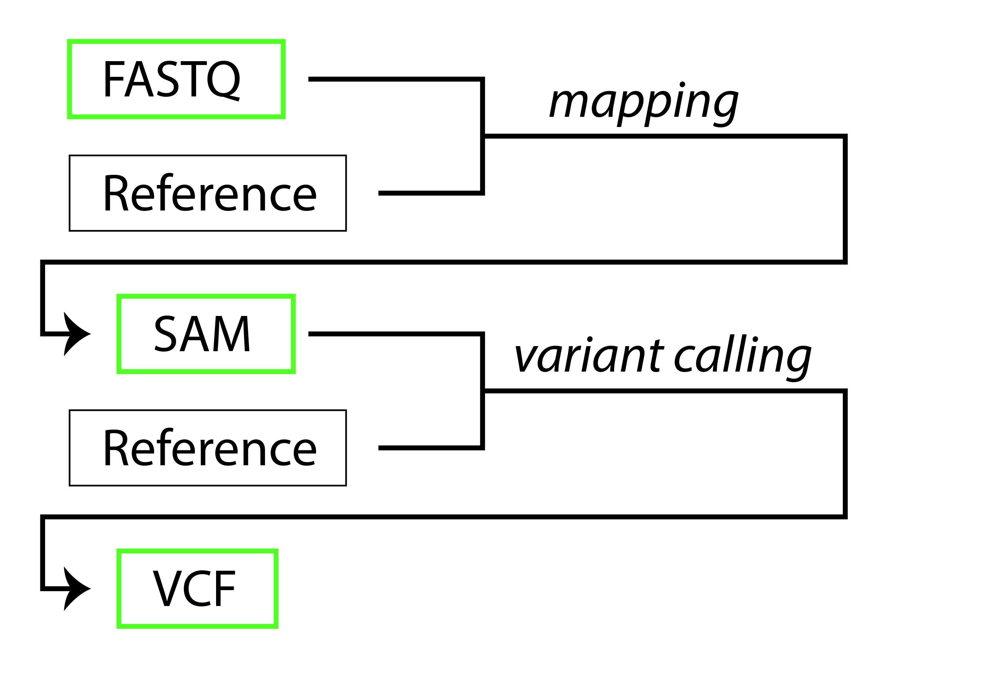

# Genomics Pipeline Intro

Introduction to basic genomics filetypes and processing techniques. The methods presented are necessary for moving from raw genomic reads to variants, but additional steps not introduced here should be implemented. In other words, the purpose of this introduction is to help individuals new to genomics understand the basics of file transformation; it is not to present every step in genomic data processing.
 
---

# Contents

-   [Objectives](#objectives)
-   [Genomic Filetypes](#genomic-filetypes)
-   [Basic Processing Steps](#basic-processing-steps)
-   [Exercise](#exercise)

---

# <a name="objectives"></a>
# Objectives 

-  Understand major genomic filetype structure (.fastq, .sam, .vcf)
-  Understand basic flow of a genomic bioinformatics pipeline
---

# <a name="getting-set-up"></a>
# Getting set up
If you are here as a UTU student taking BIOL 3300, you should do the following:

1.  Login to your [Github](https://github.com/) account.

1.  Fork [this repository](https://github.com/rklabacka/genomics-pipeline-intro), by
    clicking the 'Fork' button on the upper right of the page.

    After a few seconds, you should be looking at *your* 
    copy of the repo in your own Github account.

1.  Click the 'Clone or download' button, and copy the URL of the repo via the
    'copy to clipboard' button. **note: if you have an SSH key with your github account, make sure you select the ```SSH``` tab**

1.  In your terminal, navigate to where you want to keep this repo (you can
    always move it later, so just your home directory is fine). Then type:

        $ git clone the-url-you-just-copied

    and hit enter to clone the repository. Make sure you are cloning **your**
    fork of this repo.

1.  Next, `cd` into the directory:

        $ cd the-name-of-directory-you-just-cloned

1.  At this point, you should be in your own local copy of the repository.

    As you work on the exercise below, be sure to frequently `commit` your work
    and `push` changes to the *remote* copy of the repo hosted on Github.

# <a name="study-design"></a>
# Genomic Filetypes and Transformations

For this introduction, you will be introduced to three genomic filetypes:

1.  [FASTQ](#fastq)
2.  [SAM](#sam)
3.  [VCF](#vcf)

The purpose of a bioinformatics pipeline is to transform biological sequence data to a format that can be interpreted. In many cases, researchers are interested in variable regions within the genomes (variants). To find these regions, raw sequencing reads must be aligned (mapped) to a reference, following which the variants can be determined. An abbreviated and simplified overview of file transformations via bioinformatics pipeline is as follows:




> The "Reference" in the above diagram is an already-assembled FASTA sequence used to orient the data. The italicized words represent file transformations performed by bioinformatics software)

# <a name="fastq"></a>
## .FASTQ 
The filetype that is typically provided by a sequencing facility, FASTQ files are commonly referred to as "raw read" files. Similar to .fasta files, FASTQ files contain a <b>[sequence identifier](#fastq-seq-id)</b> and biological <b>[sequence data](#fastq-seq-data)</b>. Additionally, FASTQ files contain a sequencing <b>[quality score](#fastq-qual-score)</b> for each base pair position. Here is an example of one sequence and its associated information:

```
@SeqID
AAGCCAGCAAACCTTGTTTTACCTCACTGATATAGATTAGATATTTCAAGACAAATTTGTTGCCAATGTTAGATTATTAACATTATTTATTATAAAAATA
+
CCCFFFFFHHHHHJJJJJJJJJJJJJJJJIJJJJJJJJJJJJIJIJJJJJJJJJJJJJJJJJJJJJJIJJJJJJIJJJJHHHHHHHFFFFFFFEEEEEEC
```

# <a name="fastq-seq-id"></a>
#### 1) FASTQ Sequence Identifier
The first line is the sequence identifier. The first character for the identifier line is '@'. Similar to the '>' character in .fasta files, the '@' character in FASTQ files denotes the sequence identity for the following sequence. Additionally, this line might contain a description of the sequence. 
 
# <a name="fastq-seq-data"></a>
#### 2) FASTQ Sequence Data
The second line contains the sequence itself (string of nucleotides). The sequence is followed by a '+' on the third line to indicate the end of the sequence string.

# <a name="fastq-qual-score"></a>
#### 3) FASTQ Quality Score
The fourth line contains a quality score for each position of the sequence. Each character represents a number based on ASCII coding (see this [link](https://support.illumina.com/help/BaseSpace_OLH_009008/Content/Source/Informatics/BS/QualityScoreEncoding_swBS.htm) for the relationship between symbols and quality score value). On this scale, 0 ('!') is the lowest value, and 40 ('I') is the highest value. Because each score corresponds to a site within the sequence itself, the number of score symbols must equal the number of positions in the sequence.

#### Looking at a FASTQ file
Let's look at an example FASTQ file. These files can be very large, but example.fastq is an abbreviated file that can be opened in your text editor. If on the command line, you can examine this file using ```vim example.fastq```. 

> note: If you are new to using vim, you can exit without saving by typing ':q!' followed by enter. 

You'll notice that the sequence identifier line is more complex than the example above. Sequencing companies use this line to provide unique characteristics of each sequence. For example, Illumina paired-end sequencing (the platform and method used to obtain this sequencing data) uses a [specific format](https://help.basespace.illumina.com/articles/descriptive/fastq-files/) for the sequence ID and description.

With this info, you can parse out the information from the first sequence id in example.fastq as follows:

| Order |  description     | value      |
|:-----:|:----------------:|:----------:|
|  1    |  instrument      | D3NH4HQ1   |
|  2    |  run number      | 149        |
|  3    |  flowcell ID     | C1H5KACXX  |
|  4    |  lane            | 3          |
|  5    |  tile            | 1101       |
|  6    |  x-pos           | 2106       |
|  7    |  y-pos           | 2242       |
|  -    |  space           | -          |
|  8    |  read            | 2          |
|  9    |  is filtered     | N          |
|  10   |  control number  | 0          |
|  11   |  index number    | GCTCGGTA   |

For the purposes of this introduction, you don't need to worry about all of these elements– just that this line is the unique identifier for the sequence with additional sequencing details.

# <a name="sam"></a>
## .SAM
Sequence alignment map (SAM) files are text-based genomic files with biological sequence data aligned to a reference sequence. SAM files contain a <b>[header section](sam-header-section)</b> and an <b>[alignment section](sam-alignment-section)</b>. They contain the same information as the FASTQ file, with additional information on mapping details. As you probably gathered, that makes these files larger than the FASTQ files. To increase computational efficiency, SAM files can be converted into a <b>binary alignment Map (BAM)</b> file. BAM files are much smaller than SAM files, and this conversion is commonly done in genomic processing. Here is an example of header and alignment lines within a SAM file:

```
@SQ SN:NC_045541.1  LN:186725308
@PG ID:bwa PN:bwa CL:bwa mem -t 4 -M RefGenome.fasta Read1.fastq Read2.fastq
SeqID 99  ref_name 72165682    60  100M    =   72165982    399 TACTTATGTTCTTCTTCATTCAGGATCATATGTGAAACTTCAGAAAAGCTAATATGTGAAACTTCAGAAGACAAATATGGTGAGAACAACAGTGAAAGAG    CCCFFFFFHHHHHJIJJJJJJJIJIJJJJJIJJJJJJJJJJIIJGIJJJJJJJIJJBGIJJJIJIIJJIJJJIIICFIHEA@EGHHHHHFFFEFEEEEDE
```

# <a name="sam-header-section"></a>
#### 1) SAM Header Section
The header section precedes the alignment section, and each heading begins with the '@' symbol. Each heading contains tab-delimited sections. The first column indicates the record type. The following columns contain tags and values (in the format TAG:VALUE). While there are different tag types, two you will see often are @SQ (reference sequences) and @PG (programs used for creating .sam). The values of these tags contain information about the sequence. @SQ requires the reference sequence name (SN) and length (LN) tags, and the @PG tag requires the program identity but may also include the program name (PN), version (VN), and command line implementation (CL).


# <a name="sam-alignment-section"></a>
#### 2) SAM Alignment Section
The alignment section requires 11 tab-separated fields, and additional fields are optional. Each line within this section represents the alignment of a segment to the reference. The 11 required sections include information on the query template (read that mapped), the reference sequence name (SN), the position on reference where the query template mapped, the mapping quality, the sequence itself, and the quality score for each position in the base pair. Simplified descriptions of each required field are within the table in the [looking at a .SAM file](sam-example) section.


# <a name="sam-example"></a>
#### Looking at a SAM file
Let's look at an example SAM file. These files can be very large, but example.sam is an abbreviated file that can be opened in your text editor. If on the command line, you can examine this file using ```vim example.sam```. 
> note: If you are new to using vim, you can remove text wrap by typing ':set nowrap' followed by enter. You can see line numbers by typing ':set number' followed by enter. You can exit vim without saving by typing ':q!' followed by enter. 

You'll see that there are many @SQ header lines (one for each of the reference sequences). Each of these has a name and length. At line 366 you'll see the @PG header line for the program details. The remaining lines of the file contain alignment information. From what we learned above, we can parse the first alignment line (line 367) as follows:


| Col |  Field     | Type   |  Description                                                                  |  Value             |
|:---:|:----------:|:------:|:-----------------------------------------------------------------------------:|:------------------:|
|  1  |  QNAME     | string |  query template name                                                          |  D3NH...:4262:2214 |
|  2  |  FLAG      | int    |  bitwise flag                                                                 |  99                |
|  3  |  RNAME     | string |  ref sequence name                                                            |  NC_045541.1       |
|  4  |  POS       | int    |  1-based leftmost mapping position                                            |  72165682          |
|  5  |  MAPQ      | ing    |  mapping quality                                                              |  60                |
|  6  |  CIGAR     | string |  [CIGAR string](https://jef.works/blog/2017/03/28/CIGAR-strings-for-dummies/) |  100M              |
|  7  |  RNEXT     | string |  ref name of the mate/next read                                               |  =                 |
|  8  |  PNEXT     | int    |  position of the mate/next read                                               |  72165982          |
|  9  |  TLEN      | int    |  template length                                                              |  399               |
|  10 |  SEQ       | string |  segment sequence                                                             |  TACTTATGTTCT...   |
|  11 |  QUAL      | string |  [ASCII score](https://support.illumina.com/help/BaseSpace_OLH_009008/Content/Source/Informatics/BS/QualityScoreEncoding_swBS.html) of base quality                                                  |  @DCC?CCEC>CE...   |

# <a name="vcf"></a>
## .VCF
Variant call format (VCF) files are text-based genomic files with information on sequence variation. More specifically, it includes sites where multiple characters are present in the samples examined. A VCF file contains a <b>[header section](vcf-header-section)</b> and a <b>[variant data section](vcf-data-section)</b>. Basic VCF files do not contain information on every position from the FASTQ or reference file, rather they include information on the genomic positions with sequence variation. As you probably gathered, that makes these files smaller than the FASTQ and SAM files (and the less variation, the smaller the file). Here is an abbreviated example of header and alignment lines within a VCF file:

##### abbreviated VCF file

```
##fileformat=VCFv4.2
##FORMAT=<ID=GT,Number=1,Type=String,Description="Genotype">
##FORMAT=<ID=AD,Number=R,Type=Integer,Description="Allelic depths for the ref and alt alleles in the order listed">
##FORMAT=<ID=DP,Number=1,Type=Integer,Description="Approximate read depth (reads with MQ=255 or with bad mates are filtered)">
##FORMAT=<ID=GQ,Number=1,Type=Integer,Description="Genotype Quality">
##INFO=<ID=AC,Number=A,Type=Integer,Description="Allele count in genotypes, for each ALT allele, in the same order as listed">
##INFO=<ID=AF,Number=A,Type=Float,Description="Allele Frequency, for each ALT allele, in the same order as listed">
##INFO=<ID=DP,Number=1,Type=Integer,Description="Approximate read depth; some reads may have been filtered">
##INFO=<ID=FS,Number=1,Type=Float,Description="Phred-scaled p-value using Fisher's exact test to detect strand bias">
##contig=<ID=NC_045541.1,length=186725308,assembly=reference.fasta>
##reference=file://reference.fasta
#CHROM  POS ID  REF ALT QUAL    FILTER  INFO    FORMAT  Sample01   Sample02   Sample03
NC_045541.1 1206    .   A   G   138.21  .   AC=2;AF=0.25;DP=6;FS=0.000 GT:AD:DP:GQ  0/0:6,0:6:42   ./.:0,0:0:0   1/0:5,7:12:71
```

# <a name="vcf-header-section"></a>
#### 1) VCF Header Section
The header section precedes the variant data section, and each heading begins with '##' symbols (notice there are *two* hash marks).  Information about the variant dataset, the reference sequence, and the program used to generate the VCF are contained within the header. 
The ```FORMAT``` header lines define tags whose properties pertain to the variant site as a whole, whereas the ```INFO``` header lines describe tags whose properties pertain to the genotype for each individual in the dataset. The abbreviations in ```FORMAT``` and ```INFO``` header lines correspond with those in the data section. The abbreviated VCF file example above defines four ```FORMAT``` tags (GT, AD, DP, and GQ) and four ```INFO``` (AC, AF, DP, and FS) tags.  The ```contig``` and ```reference``` sections contain information about the reference used for variant calling.

# <a name="vcf-data-section"></a>
#### 1) VCF Variant Data Section
The variant section consists of a row for every variant. The columns provide information about (1) site-level properties and annotations and (2) sample-leve annotations. The first section of columns (site-level properties and annotations) correspond to the variant site as a whole. This section consists of 8 columns, all of which are required in the vcf file (```CHROM```, ```POS```, ```ID```, ```REF```, ```ALT```, ```QUAL```, ```FILTER```, ```INFO```). These required fields include information about the location, the reference allele, the alternate allele(s), and the quality of the SNP. While these fields are required for each variant, they can be empty (a signified by `.`). Descriptions for each of these fields are shown in the table below (values are from the variant of the abbreviated vcf file above).

| Col |  Field  |  Description                                                                   |  Value        |
|:---:|:-------:|:------------------------------------------------------------------------------:|:-------------:|
|  1  | ```CHROM```  |  Contig name                                                                   |  NC_045541.1  |
|  2  | ```POS```    |  Position of variant within contig                                             |  1206         |
|  3  | ```ID```     |  Optional identifier for variant                                               |  .            |
|  4  | ```REF```    |  Reference allele (sequence character(s) at POS in reference)                  |  A            | 
|  5  | ```ALT```    |  Alternate allele (sequence character in at POS in at least one sample)        |  G            |
|  6  | ```QUAL```   |  Phred-scaled probability that variant exists at this site given data*         |  138.21       |
|  7  | ```FILTER``` |  ```PASS``` means the variant has passed filtering, . means no filtering has occurred|  .      |
|  8  | ```INFO```   |  Site-level annotations (properties of variant site as a whole)                |  AC=2;AF=0.25;DP=6;FS=0.000 |

###### \* Value of 10 means 0.1 chance of error; value of 100 means 0.0000000001 chance of error

The ```INFO``` values correspond to the flags defined in the header, where descriptions are provided. In the abbreviated vcf file, we see that this variant as an allele count (```AC```) of 2 (there are two alleles at this site), a minor allele frequency (```AF```) of 0.4 (the alternate allele's frequency in the dataset), a depth of coverate (```DP```) of 6 (the average depth per-individual at this site is 6 reads), and a p-value (```FS```) of 0.000. There are typically more property fields than this in a vcf, but this hopefully gives you a sense of how to read these sections.

The subsequent columns pertain to sample-level annotations. These fields consist of the formatting for the sample-specific property (```FORMAT```) followed by a column for each sample. In the abbreviated vcf file above, there are three samples (```Sample01```, ```Sample02```, and ```Sample03```). The values within the sample columns correspond to the ordered flags shown in the ```FORMAT``` column. These properties are shown in table format below; the Col values are a continuation from the table above.

| Col |  Field          |  Description                            | Value           |
|:---:|:---------------:|:---------------------------------------:|:---------------:|
|  9  |  ```FORMAT```   | Format for sample-specific annotations  | GT:AD:DP:GQ     |
|  10 |  ```Sample01``` | The annotation values for Sample 01     | 0/0:6,0:6:42    |
|  11 |  ```Sample02``` | The annotation values for Sample 02     | ./.:0,0:0:0     |
|  12 |  ```Sample03``` | The annotation values for Sample 03     | 1/0:5,7:12:71   |

The value column can be somewhat challenging to understand, so we'll break it down:

| Flag | Description                  | ```Sample01``` | ```Sample02``` | ```Sample03``` |
|:----:|:----------------------------:|:--------------:|:--------------:|:--------------:|
| GT   | Genotype\*                   | 0/0            | ./.            | 1/0            |
| AD   | Allele depth\*\*             | 6,0            | 0,0            | 5,7            |
| DP   | Total depth at variant site  | 6              | 0              | 12             | 
| GQ   | Genotype quality\*\*\*       | 42             | 0              | 71             |

###### \* Depth for ref , depth for alt
###### \*\* 0/0 = homozygous for ref allele; 1/1 = homozygous for alt allele; 1/0 = heterozygous; ./. no data
###### \*\*\* Value of 10 means 0.1 chance of error; value of 100 means 0.0000000001 chance of error

# <a name="vcf-example"></a>
#### Looking at a VCF file

Now check out the example.vcf file. These files can be very large, but example.vcf is an abbreviated file that can be opened in your text editor. If on the command line, you can examine this file using ```vim example.vcf```. 

> note: If you are new to using vim, you can remove text wrap by typing ':set nowrap' followed by enter. You can see line numbers by typing ':set number' followed by enter. You can exit vim without saving by typing ':q!' followed by enter. 

---

# <a name="exercise"></a>
# Exercise
The basic workflow and data for this exercise come from [Farkas et al., 2021](https://doi.org/10.3389/fmicb.2021.665041) and the associated [github repository](https://github.com/cfarkas/SARS-CoV-2-freebayes).

## Exercise Objective
Download and analyze a small sample of genomic data using published scripts to see an applied process of genomic data processing.


To complete this exercise, complete the following steps and answer the questions contained within the worksheet.md file. Once you have completed the worksheet, add, commit, and push the worksheet to your forked repository.

```
add worksheet.md
git commit -m "answered worksheet questions"
git push
```

## Exercise set up
> note: if you haven't cloned this repository yet, make sure you have it cloned (see [Getting set up](#getting-set-up) section)

[Exercise](#exercise)
1.  Make sure [mini/anaconda](https://docs.conda.io/en/latest/miniconda.html) and python versions = 2.7 and >=3.0 are installed.
2.  Make sure you are in repository directory and activate conda environment
```
conda config --add channels conda-forge                        # add conda-forge channel (if you haven't already done so)
conda config --add channels bioconda                           # add bioconda channel (if you haven't already done so)
conda env update --file environment.yml                        # install required programs
conda activate genomics-pipeline-intro                         # activate genomics-pipeline-intro enviroment
```

3. Install the latest version of sra toolkit. See instructions here:
```
https://github.com/ncbi/sra-tools/wiki/02.-Installing-SRA-Toolkit
```

## Raw reads to vcf

For this exercise, you will run a bash script containing an abbreviated version of the genomics processing pipeline from [Farkas et al., 2021](https://doi.org/10.3389/fmicb.2021.665041). 

You can see the parameters required for the script by looking at the help menu:
```
bash bash_scripts/genomics-pipeline-intro -h
```

Now that you have examined the script, run it.

```
bash_scripts/genomics-pipeline-intro -l July_28_2020_NorAm.txt -g covid19-refseq.fasta -a 0.4999 -t 4
``` 

You should see messages printing to stdout as the script runs. The first of these messages will look like this:
```
Downloading SRA files from the given list of accessions

2022-03-19T16:00:22 prefetch.2.11.2: Current preference is set to retrieve SRA Lite files with simplified base quality scores.
2022-03-19T16:00:23 prefetch.2.11.2: 1) Downloading 'SRR11851929'...
2022-03-19T16:00:23 prefetch.2.11.2: SRA Normalized Format file is being retrieved, if this is different from your preference, it may be due to current file availability.
2022-03-19T16:00:23 prefetch.2.11.2:  Downloading via HTTPS...
2022-03-19T16:00:26 prefetch.2.11.2:  HTTPS download succeed
2022-03-19T16:00:26 prefetch.2.11.2:  'SRR11851929' is valid
2022-03-19T16:00:26 prefetch.2.11.2: 1) 'SRR11851929' was downloaded successfully
2022-03-19T16:00:26 prefetch.2.11.2: 'SRR11851929' has 0 unresolved dependencies
```

> note: Running into error messages is part of the coding experience. If you run into an error message, don't get too discouraged! First, read the error message. Is it an easy fix? If you aren't sure, copy and paste the error message into an online search engine to see if anyone else has experienced the error and discovered a solution. If you continue having trouble, reach out to your instructor over email to ask for help.

The script will take a few minutes to run. Once the finished, check that everything ran to completion. Your directory should now contain 8 .fastq.gz files, 8 .bam files, 8 VCF files beginning with ```SRR```, and 1 merged.vcf file. You can verify this information with the following commands:
```
ls *.fastq.gz | wc -l  # Number of .fastq.gz files
ls -l *.fastq.gz       # Make sure the .fastq.gz files aren't empty
# The fifth column in the above output is the file size
ls SRR*.vcf | wc -l    # Number of SRR*.vcf files
ls -l SRR*.vcf         # Make sure the *.vcf files aren't empty
ls -l merged.vcf       # Make sure the merged.vcf file isn't empty
```

If the above check worked, congratulations! You successfully ran a published bioinformatics pipeline! Once again, this is not a complete bioinformatics pipeline. The sampling was significantly reduced to allow for shorter computation time, and downstream variant processing is required.

